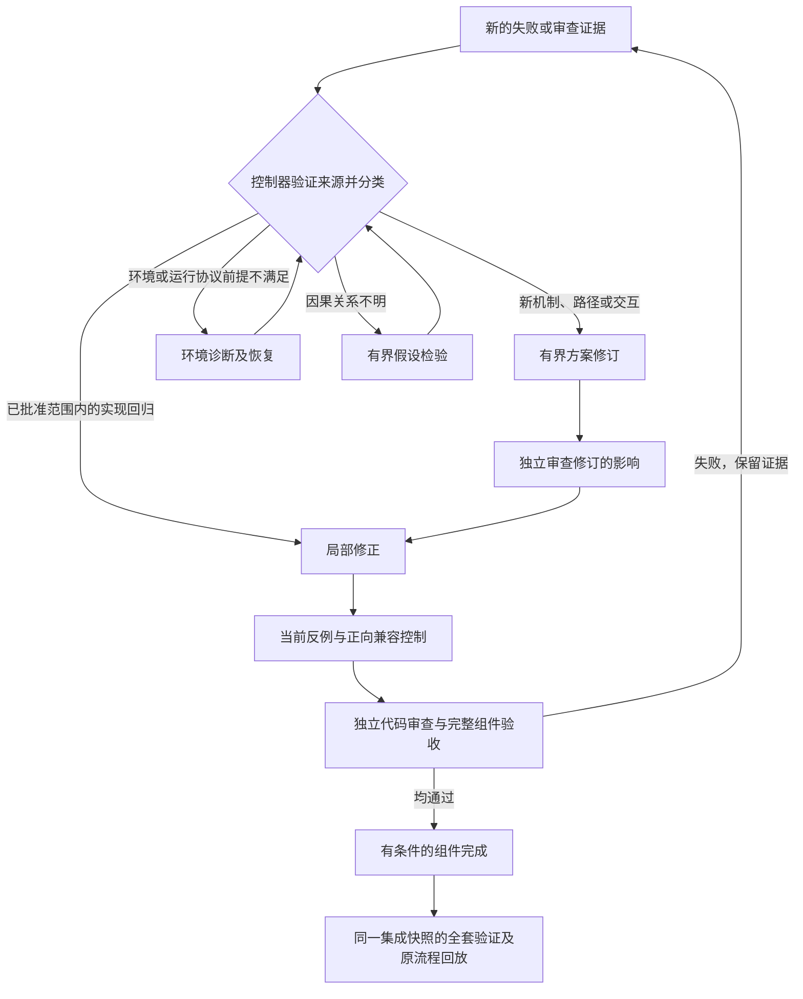

# Self-repair 收敛设计复核与改进方案

日期：2026-09-14。依据：session `6a0cedd6674d`、job
`738de054c3634ab9b7cddccb` 的真实执行记录和引擎 `7e5ff7b23a39`。
本次实现、测试和回放在独立开发副本中进行，运行中的控制进程及候选工作区未修改。
控制器后续记录该作业于 13:27:58 进入 `cancelled`，中断在第 95 轮的方案审查阶段；
这不表示第 95 个实现候选已经生成或完成。任务取消不是本次审计发起的操作。

## 判断

当前低效率包含明确的调度设计缺口和实现错误。独立审查发现的回归是真问题，
但解决这些问题之前反复走错流程、丢失已有证据，扩大了每次失败的成本。
测试通过证明被测行为符合要求；它没有证明长时间运行的修复过程能够持续收敛。
此前的系统审计没有充分验证这一点。

94 是跨历史任务累计的候选编号，并非这次启动连续进行了 94 轮。
不过，仅本次 c93/c94 的完整路径已经足以复现问题：

| 已记录行为 | 耗时/结果 | 含义 |
| --- | --- | --- |
| c93：准备、规划、实现、验证和审查 | 约 78.9 分钟；新增 3 个候选回归 | 验收拒绝有实质依据 |
| c94：同一组件的下一轮 | 约 81.7 分钟；解决上述 3 个问题，又引入 1 个回归 | 修复有局部进展，组件仍未通过 |
| c94 实施前的范围与方案流程 | 约 47.5 分钟 | 已定位问题仍需大量前置往返 |
| 其中，仅补 scenario.finding_ids 的格式调用 | 10.04 分钟 | 新语义问题被错误当成格式问题 |
| 接着审查仅改引用的旧方案 | 10.73 分钟；要求补充具体修复 | 审查正确否决了调度器送来的不合适输入 |

时间来自 job 的 `repair.log`、planning 请求的 `metrics.json` 和控制事件。
c94 的格式阶段为 11:54:53–12:04:55，随后审查为 12:05:18–12:16:02；
它还需要真正的方案修订和再审查。并发执行的代码审查与扩展验证按墙钟区间计时，不能相加。
截至 12:58 的事件快照中，90 次内部验证调度累计排队约 0.235 秒，
不足以支持“主要是资源排队”的解释。这个时间窗不代表完整任务。

本次问题还说明：原始分组名是 invocation semantics，实际方案已涉及 tracing custody、
sandbox、launcher、cache 的多层交互。用“第 1 组”展示进度掩盖了该组的实际复杂度。

## 已落地的有限改动

### 1. 找回实际执行范围内的独立代码审查

`remember_review` 使用合并了批准方案的执行组件保存证据；
`_implementation_bindings` 原来使用原始分组查找。方案扩大或缩小 touched_paths 后，
两者的 component_key 不同，已有的 implementation 分类因此失联。

修复后优先查询批准方案的实际执行范围，并兼容旧的原始分组记录。
仍检查记录摘要、类型、组件归属、计划引用、合同、环境，以及具体发现与场景、义务、路径的对应关系。
当前记录损坏或不兼容时，不能借旧记录获得复用资格。

真实记录的只读对比见 [回放结果](self-repair-convergence-evidence.json)：

| 独立审查发现 | 原代码查找结果 | 修复后的分类 |
| --- | --- | --- |
| c93：排除 evidence 路径时漏掉真实输入 | 找不到绑定 | 已批准场景内的实现修正 |
| c93：trace custody 改变 clean execution 环境 | 找不到绑定 | 已批准场景内的实现修正 |
| c93：launcher 参数解析不支持新 `-I` 形式 | 找不到绑定 | 仍拒绝直接复用；涉及批准范围外的 2 个文件 |
| c94：合法的注册依赖链接使有效缓存失效 | 找不到绑定 | 已批准的有效复用和 launcher 场景内的实现修正 |

回放只运行旧版和新版的证据绑定函数，不调用模型、不运行候选、不写历史状态。
它证明路由所需证据可以找回，不证明这些候选正确，也没有绕过其余复用条件。
c93 的整个问题集合仍需要一次有针对性的方案修订。

### 2. 新语义证据直接进入方案修订

已有批准方案不能复用，且出现新增发现或同一发现的新反例时，下一步应是
`amend_plan → 独立方案审查`。原先仅因组件签名相同便选择 `review_retained_plan`，
随后校验发现缺少 finding_ids，又进入禁止语义修改的格式流程。

新版本保存方案修订时的发现指纹；旧记录从原审查收据取回基线。
缺少历史基线时保守修订，不能假定新问题已被处理。上下文明确列出变化的发现。
单纯的源代码、环境或批准证据失效，仍可复核保留方案，无需重写方案。
旧任务中排队的错误审查阶段也可迁移，已用语义次数和格式调用总数不会清零。
已经耗尽的 episode 不会因此获得新预算。

同时补齐方案输入的保护：原先只有 amendment 回复被检查是否删除旧场景，
完整 JSON 回复可以避开该检查。两种回复现在遵守同一场景保留规则；
删掉恢复场景再声明不适用的提案会在探针和审查之前被拒绝。

### 3. 当前代码审查可以解除旧的“仅验证”模式

即使没有测试命令失败，只要独立代码审查证实存在已绑定的实现错误，控制器就应允许实现修正。
原先通用 `implement` 下一步可能被旧 `verify_existing` 观察覆盖，形成只验证、无法改代码的循环。
现在有效的 finding/scenario 绑定优先进入 implement；它不会授予验收成功。

上述三项路由修复和场景保留检查是本次代码实现的边界。
下文的统一事件路由、独立验证服务和工作项迁移尚未实现。

## 推荐架构：保留验证底座，重做收敛调度

[现有设计](self-repair-convergence-plan.md) 已经提出增量方案、独立审查、条件复用、
检查并发和有界诊断。再次增加同名开关无法解决本次问题。
需要把这些约定变成一个可回放、可验证的控制器状态机，并统一其证据身份。

| 方案 | 价值 | 代价及适用性 |
| --- | --- | --- |
| 只修局部路由 bug | 尽快消除本次已证实的绕路 | 本次已实现；仍需验证长时间收敛 |
| 保留隔离、ledger、恢复底座，替换收敛调度层 | 消除多个模块各自解释“下一步”的分歧 | 推荐；可按真实历史逐步迁移 |
| 全新平台，重新实现隔离、验证、修复和发布 | 可彻底改变接口 | 新平台本身要建立可信验证和迁移证明，当前不作为最快路径 |

### 稳定工作项和明确证据依赖

组件、缺陷、方案授权、审查事实、执行结果、运行环境各有独立身份。
实体身份不再由当前 touched_paths 推导；路径与内容哈希是版本和依赖信息。
分组拆分或迁移须有控制器记录，不能因相似文件或相同义务串借用完成状态。

建议每个工作项至少记录：稳定 work_id、原始 obligation_ids、反例及其版本、
所属组件、当前候选快照、批准的机制与路径范围、相关场景、所需完整验收、
支持每次状态变化的证据引用、已否定假设和中断状态。

控制器只有在对应证据有效时才进行以下转换：

同一条代码审查事实应当能同时表达失败机制、范围依据和已覆盖场景。
当这些字段已被独立审查并经过控制器校验，后续无需再调用模型重述同一判断。
不能完整证明范围的发现仍走独立范围检查，安全例外和不完整依赖不会自动继承。
JSON 提取、结构校验、确定性的身份迁移归控制器；需要选择新机制的问题必须标成语义工作。

### 把反例放到局部修复的入口

更大的流程变化是让独立审查尽量交付“可验证的失败 + 必須保留的成功行为”。
实现者先处理它们，随后接受独立复查，而不是每次先写一份覆盖整个历史的大方案。
无法自动化的语义缺陷可以保留具体审查证据，不能为了凑测试把 import/setup 失败当成反例。

本次 c94 的入口就应包含两面：拒绝未知或不可信的链接；允许执行器登记的合法依赖别名，
同时确保真实依赖改变会使缓存失效。只有禁止项的用例不足以保护兼容性。
这一模式针对“修好一边、破坏另一边”的故障族；补丁前后须验证相同控制和原始完整验收。

按因果依赖闭包拆分修复，把 tracing custody、launcher 协议和缓存兼容性的跨层影响显式列出。
保留通过验收的集成基线，以及尚未通过的局部候选；未验证改动可以留存，但不能被标成已完成基础。
必要的跨层变更可以作为一个事务共同验收，不能为了小 diff 人为切断依赖。

### 分离运行中的验证者和被修复的引擎

当前已有独立控制进程和隔离执行，这部分应保留。更进一步，验证协议和固定安全探针
由版本固定的控制面提供，修复任务消费已协商的能力，避免在同一任务里不断重新解释外层 launcher。

修复验证基础设施本身时，建立单独的维护版本：旧控制面执行固定安全、兼容、恢复探针，
证明新版本满足边界和协议要求，才在停止写入的交接点启动新控制面。
候选目录中的 import 不会自动替换运行中的 supervisor；代码、协议和证据的版本必须分别绑定。
这部分是架构建议，不能通过热替换正在运行的作业来试验。

### 让重复失败改变诊断，而不是重置循环

保留按因果机制整理的反例和已否定假设。相同故障族再现时，应检查补丁范围、
先前结论依赖和遗漏的相邻输入类别，再选择下一项能区分假设的诊断。
改 finding_id、换 commit、重启进程不代表新的进展。

局部修正、规划和诊断分别计数，重启保留计数；耗时及重复次数用于触发定位和报告。
预算耗尽只能形成具体未解决事项，不能免除质量条件、伪造完成，或无证据重开整套计划。
若已没有能增加信息的动作，应保留成果并明确卡点，而不是继续消耗模型调用。

### 控制上下文和昂贵检查的位置

局部修正主要读取当前反例、受影响 diff、机制边界和对应验收。原合同始终可访问；
历史结论和完整日志保留可追溯引用，避免每次强制重读数万字符历史。
上下文缩小不能删除反对证据、完整场景清单或不确定的依赖。

保持现有先快速失败检查、再同一冻结快照上的代码审查与完整组件验证的并发方式。
只复用依赖、环境、执行策略和来源仍有效的证据；不完整观察仍需运行。
最终集成审查、全套验证、会话恢复及用户原流程回放均保留。
本次不改变模型质量、验证数量、sandbox 权限或缓存失效规则。

## 验证与迁移

新增测试首先在原版本复现了 5 个失败，覆盖执行范围变更、错误格式路由、
同 ID 新证据的旧方案复核，以及仅验证模式停滞。随后补充真实阶段顺序、
异常和跨组件证据拒绝、旧记录兼容、重启阶段迁移及不续发预算的检查。
验证仍包含原有收敛、规划、恢复、条件完成、范围恢复和路由测试。

最终本地验证：12 个相关测试文件，**242 passed in 74.54s**，其中新增 22 个回归用例；
`git diff --check` 通过。测试包含模拟 provider 的阶段转换和真实本地 Git/证据存取，
没有启动一次生产模型驱动的完整 self-repair；74.54 秒是测试耗时，并非修复任务耗时。
本次没有重跑整个仓库测试集，也未自动恢复被取消的原任务。

扩大调度改造前的准入条件：

1. 真实 c93/c94 记录回放能解释每次路由；已覆盖实现修正不产生新的规划调用，越界仍需修订。
2. 人为中断每个持久化边界后，重启没有重复写入、虚假进展、丢失反例或增加尝试预算。
3. 故障注入序列包含“修复旧问题、引入新回归”、损坏证据、环境变化和并发拒绝；完整验收不能缩水。
4. 在隔离实例运行原场景，记录实际耗时和状态变化；再通过只计算决策的影子模式比较现网路径。
5. 在没有运行中写入的版本交接点采用新控制器，重新校验有效证据；不能把历史计数或未通过候选清零。

持续度量 time-to-verified-fix、已闭合缺陷和新增回归、纯规划耗时、重复调用、
每类证据失效原因、模型实际工作输入量、组件及最终验收耗时。
需同时观察速度和遗漏回归；只统计“本轮调用更少”不够。

这次可以证明消除了特定重复路径，并保留相关质量约束。
不能把 c94 那两段约 20.8 分钟的已观察重复工作直接当作每轮固定节省，
也不能承诺 94 轮一定变成某个数字。整次 self-repair 的收敛和耗时仍须通过隔离实跑验收。
